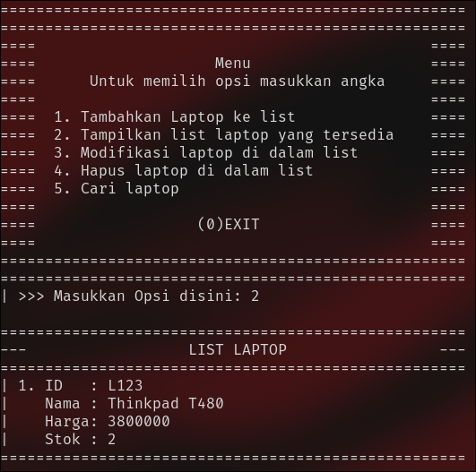
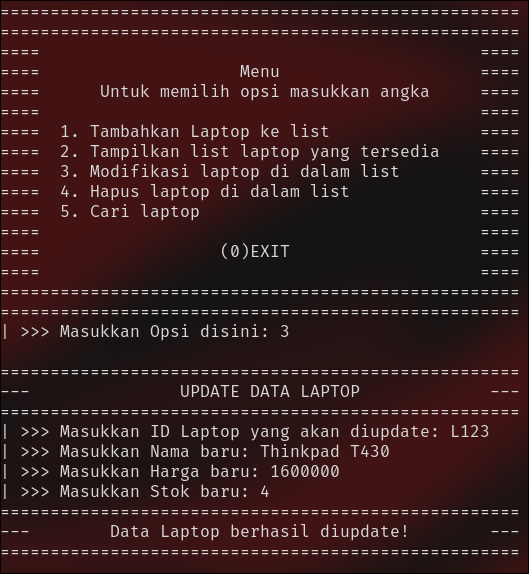
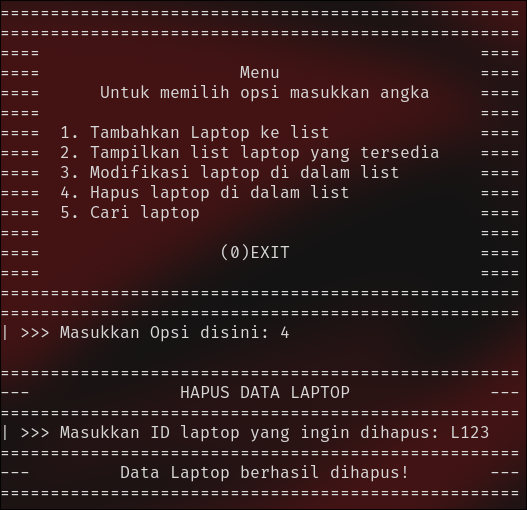
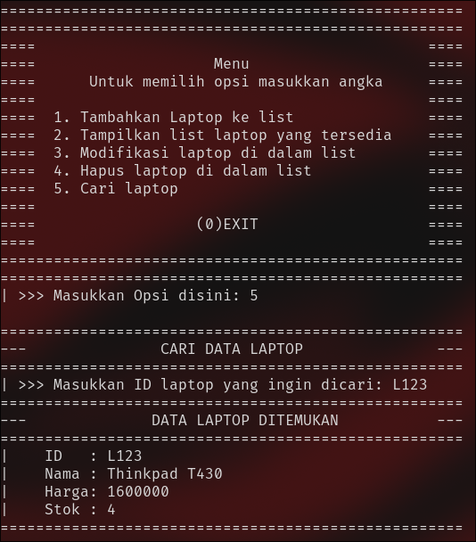
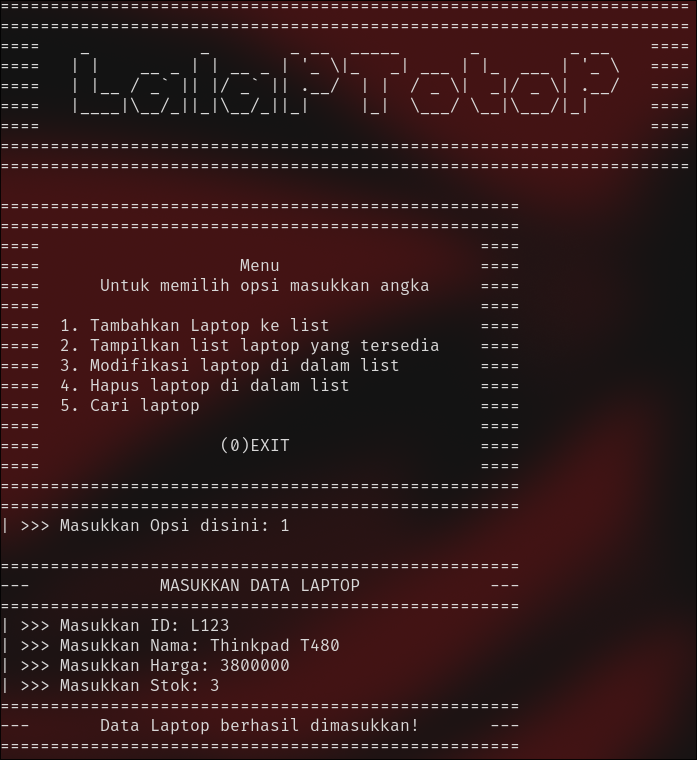
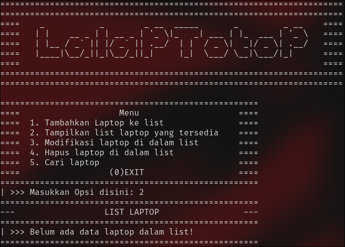
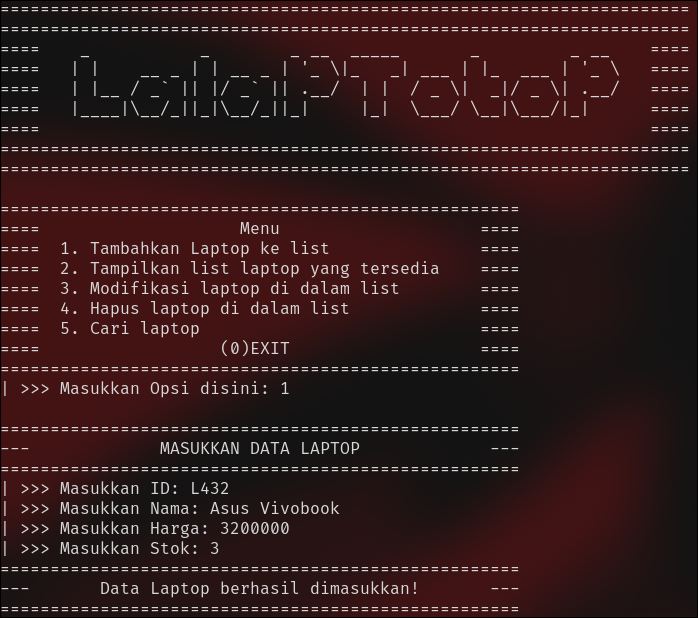
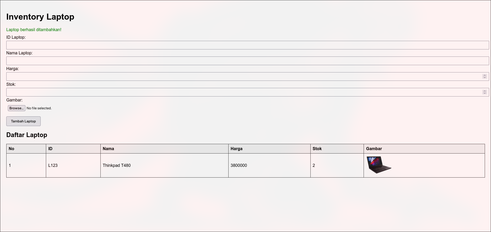

# TP1DPBO2425C1

---

Saya Zharfan Faza Wibawa dengan NIM 2403995 mengerjakan Tugas Praktikum 1 dalam mata kuliah Desain Pemrograman Berbasis Objek untuk keberkahanNya maka saya tidak melakukan kecurangan seperti yang telah dispesifikasikan. Aamiin

---

## :gear: Deskripsi Program  
Pada program ini saya membuat data dari sebuah toko laptop dengan beberapa fitur yaitu:

## Tambah data (Add)

  

- Tampilkan data (Show)
 

- Ubah Data (Update)
 

- Hapus Data (Delete)
 

- Cari Data (Search by ID)
 

---

## :file_folder: Dokumentasi Program
CPP : 
 

Java :
 

Python : 
 

PHP :
 

