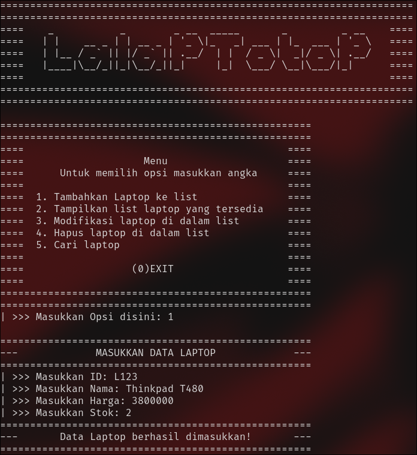

# TP1DPBO2425C1

---

Saya Zharfan Faza Wibawa dengan NIM 2403995 mengerjakan Tugas Praktikum 1 dalam mata kuliah Desain Pemrograman Berbasis Objek untuk keberkahanNya maka saya tidak melakukan kecurangan seperti yang telah dispesifikasikan. Aamiin

---

## :gear: Deskripsi Program  
Pada program ini saya membuat data dari sebuah toko laptop dengan beberapa fitur yaitu add, show, update, delete, dan search by id

Jika kita mengetik opsi 1 maka program akan meminta input data laptop

  

Jika kita mengetik opsi 2 maka program akan menampilkan semua list laptop

  

Jika kita mengetik opsi 3 maka program akan meminta input data laptop untuk diperbaharui

  

Jika kita mengetik opsi 4 maka program akan meminta input id laptop untuk dihapus

  

Jika kita mengetik opsi 5 maka program akan meminta input id laptop untuk dicari di list

  

---

## :file_folder: Dokumentasi Program
CPP : 

  

Java :

  

Python : 

  

PHP :

  

